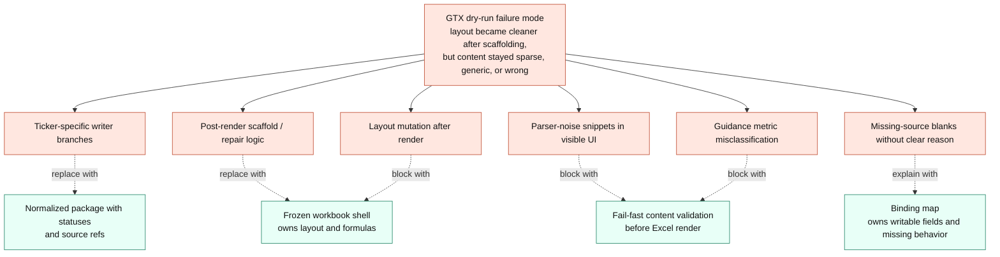

> Historical migration/target-state artifact; not the current operator authority.

# Code Structure Map

This document is a visual, source-grounded map of the current stock-model architecture and the intended ownership boundaries for the new-ticker engine. It is documentation only: no production writer, runtime, workbook, or ticker output behavior is changed by this map.

Primary source documents:

- `docs/new_ticker_engine_audit.md`
- `docs/new_ticker_data_lineage_audit.md`
- `docs/sheet_data_flow_map.json`
- `docs/workbook_binding_map.json`
- `docs/standard_template_shell_manifest.json`

Renderable Mermaid source: `docs/code_structure_map.mmd`.

## How To Read This

Read left to right inside each diagram band:

- Source/cache data is blue.
- Parsing and derived fact selection is green.
- Existing workbook writer ownership is orange.
- Workbook sheets and shell presentation concerns are purple.
- Validation and QA concerns are gray.
- GTX-derived failure points are red.
- Future new-ticker engine ownership is teal.

The key architectural shift is from writer-centric workbook construction to package-centric rendering: data should be normalized and validated before Excel sees it, then written through explicit binding IDs into a frozen shell.

## 1. Current System Architecture

```mermaid
flowchart LR
  classDef source fill:#e8f3ff,stroke:#2f6fab,color:#111111
  classDef transform fill:#eef8ed,stroke:#4f8b45,color:#111111
  classDef writer fill:#fff4db,stroke:#b57915,color:#111111
  classDef workbook fill:#f2ecff,stroke:#7655b5,color:#111111
  classDef validate fill:#f6f6f6,stroke:#626262,color:#111111

  Sources["Source files / caches<br/>SEC cache, IR docs, transcripts,<br/>presentations, market cache, writer cache"]:::source
  ManualProfile["Company profile config<br/>company_profiles.py<br/>summary_overview.py"]:::source
  Parsers["Parsers and extraction<br/>pipeline.py, sec_xbrl.py, sec_ingest.py,<br/>doc_intel.py, quarter_notes.py"]:::transform
  Derived["Derived/selected facts<br/>valuation.py, valuation_precompute_runtime.py,<br/>segment, guidance, driver helpers"]:::transform
  Orchestrator["Workbook orchestration<br/>excel_writer.py<br/>excel_writer_core.py"]:::writer
  Writers["Writer families<br/>summary, valuation, segments, drivers,<br/>investment case, UI, QA, raw/support"]:::writer
  Support["Support sheets<br/>History_Q, DATA_Facts_Long, SEC_Audit_Log,<br/>Guidance_Raw, Guidance_Normalized,<br/>Quarter_Notes, Promise_Progress"]:::workbook
  Visible["Visible workbook UI<br/>SUMMARY, Valuation, BS_Segments,<br/>Operating_Drivers, Investment_Case,<br/>Quarter_Notes_UI, Promise_Progress_UI,<br/>QA_Log, Needs_Review, QA_Checks"]:::workbook
  QA["Validation / QA<br/>workbook_validation_runner.py<br/>workbook_quality_guardrails.py<br/>writer_qa_policy.py"]:::validate

  Sources --> Parsers
  ManualProfile --> Derived
  Parsers --> Derived
  Derived --> Orchestrator
  ManualProfile --> Orchestrator
  Orchestrator --> Writers
  Writers --> Support
  Support --> Visible
  Writers --> Visible
  Visible --> QA
  Support --> QA
```

Today the writer path owns both presentation and a meaningful amount of data selection. Support sheets are used both as intermediate storage and audit evidence. That makes it hard to onboard a new ticker safely because missing-source behavior can surface as blank UI, post-render fixes, or ticker-specific writer branches.

## 2. Sheet Ownership Map

```mermaid
flowchart TB
  classDef sheet fill:#f2ecff,stroke:#7655b5,color:#111111
  classDef current fill:#fff4db,stroke:#b57915,color:#111111
  classDef future fill:#e8fff7,stroke:#27876a,color:#111111
  classDef validate fill:#f6f6f6,stroke:#626262,color:#111111

  subgraph VisibleSheets["Visible Sheets"]
    SUMMARY["SUMMARY"]:::sheet
    Valuation["Valuation"]:::sheet
    BSSegments["BS_Segments"]:::sheet
    Drivers["Operating_Drivers"]:::sheet
    InvestmentCase["{ticker}_Investment_Case"]:::sheet
    QuarterNotes["Quarter_Notes_UI"]:::sheet
    PromiseProgress["Promise_Progress_UI"]:::sheet
    QALog["QA_Log"]:::sheet
    NeedsReview["Needs_Review"]:::sheet
    QAChecks["QA_Checks"]:::sheet
  end

  SummaryOwner["excel_writer_summary_builder.py<br/>excel_writer_summary_sheet.py<br/>summary_overview.py"]:::current
  ValuationOwner["excel_writer_valuation_orchestrator.py<br/>excel_writer_valuation_*<br/>valuation.py"]:::current
  SegmentOwner["excel_writer_bs_segments.py<br/>excel_writer_segments.py<br/>excel_writer_segment_sources.py"]:::current
  DriverOwner["excel_writer_drivers.py<br/>operating_drivers_runtime.py"]:::current
  CaseOwner["excel_writer_sector_investment_case.py<br/>excel_writer_investment_case_support.py<br/>excel_writer_anf_investment_case.py"]:::current
  QuarterOwner["excel_writer_quarter_notes_ui_orchestrator.py<br/>quarter_notes.py<br/>quarter_notes_runtime.py"]:::current
  PromiseOwner["excel_writer_promise_progress.py<br/>doc_intel.py"]:::current
  QAOwner["excel_writer_core.write_qa_sheets()<br/>writer_qa_policy.py<br/>pipeline_qa.py"]:::current

  Normalized["Future value owner<br/>normalized company data package"]:::future
  Binding["Future presentation owner<br/>frozen shell + binding map"]:::future
  Validators["Future QA owner<br/>pre-render content validation<br/>shell/workbook validation"]:::validate

  SummaryOwner --> SUMMARY
  ValuationOwner --> Valuation
  SegmentOwner --> BSSegments
  DriverOwner --> Drivers
  CaseOwner --> InvestmentCase
  QuarterOwner --> QuarterNotes
  PromiseOwner --> PromiseProgress
  QAOwner --> QALog
  QAOwner --> NeedsReview
  QAOwner --> QAChecks

  SUMMARY --> Normalized
  Valuation --> Normalized
  BSSegments --> Normalized
  Drivers --> Normalized
  InvestmentCase --> Normalized
  QuarterNotes --> Normalized
  PromiseProgress --> Normalized
  QALog --> Validators
  NeedsReview --> Validators
  QAChecks --> Validators
  Normalized --> Binding
  Binding --> SUMMARY
  Binding --> Valuation
  Binding --> BSSegments
  Binding --> Drivers
  Binding --> InvestmentCase
  Binding --> QuarterNotes
  Binding --> PromiseProgress
  Validators --> QALog
  Validators --> NeedsReview
  Validators --> QAChecks
```

| Visible sheet | Current writer/module owner | Intended normalized sections | Support/intermediate inputs | Intended future owner |
| --- | --- | --- | --- | --- |
| `SUMMARY` | `excel_writer_summary_builder.py`, `excel_writer_summary_sheet.py`, `summary_overview.py`, `excel_writer_core.py` | `company_profile`, `quarterly_financials`, `debt_liquidity` | `History_Q`, `SEC_Audit_Log`, profile data | Normalized package plus `summary_*` bindings |
| `Valuation` | `excel_writer_valuation_orchestrator.py`, `excel_writer_valuation_*`, `valuation.py`, `valuation_precompute_runtime.py` | `quarterly_financials`, `annual_financials`, `debt_liquidity`, `capital_returns`, `normalized_guidance` | `History_Q`, guidance support sheets, valuation precompute data | Value-only valuation bindings |
| `BS_Segments` | `excel_writer_bs_segments.py`, `excel_writer_bs_segments_sheet_adapter.py`, `excel_writer_segments.py`, `excel_writer_segment_sources.py` | `debt_liquidity`, `segments`, `quarterly_financials`, `annual_financials` | `DATA_Facts_Long`, `History_Q`, segment support | Segment/debt bindings plus audit support |
| `Operating_Drivers` | `excel_writer_drivers.py`, `operating_drivers_runtime.py`, `excel_writer_operating_drivers.py` | `operating_drivers`, `normalized_guidance`, `quarterly_financials` | operating driver raw/support data, profile configuration | Driver bindings |
| `{ticker}_Investment_Case` | `excel_writer_sector_investment_case.py`, `excel_writer_investment_case_support.py`, `excel_writer_anf_investment_case.py` | `investment_case`, `normalized_guidance`, `segments`, `operating_drivers`, `quarter_notes` | `Guidance_Normalized`, `Slides_Guidance`, `Quarter_Notes` | Investment-case bindings; no ticker-specific visible layout code |
| `Quarter_Notes_UI` | `excel_writer_quarter_notes_ui_orchestrator.py`, `excel_writer_quarter_notes_ui_*`, `quarter_notes.py`, `quarter_notes_runtime.py` | `quarter_notes`, `quarterly_financials`, `normalized_guidance` | `Quarter_Notes`, `Quarter_Notes_Evidence`, `Quarter_Narrative_Data` | Quarter-note bindings |
| `Promise_Progress_UI` | `excel_writer_promise_progress.py`, `excel_writer_promise_progress_*`, `doc_intel.py` | `normalized_guidance`, `quarter_notes`, `source_coverage` | `Guidance_Raw`, `Guidance_Normalized`, `Slides_Guidance`, `Promise_Progress`, `Promise_Evidence` | Guidance/promise bindings |
| `QA_Log` | `excel_writer_core.write_qa_sheets()`, `writer_qa_policy.py` | `source_coverage`, validation issues | SEC/quarter-note evidence and workbook validation | Validation report bindings |
| `Needs_Review` | `excel_writer_core.write_qa_sheets()`, `writer_qa_policy.py`, `pipeline_qa.py` | `manual_review_flags`, validation issues | pipeline QA and missing-source evidence | Manual review bindings |
| `QA_Checks` | `excel_writer_core.write_qa_sheets()`, `workbook_validation_runner.py`, `workbook_quality_guardrails.py` | `mapping_gaps`, validation issues, source coverage | support sheets plus validation outputs | QA check bindings |

## 3. Data Lifecycle Map

```mermaid
flowchart LR
  classDef source fill:#e8f3ff,stroke:#2f6fab,color:#111111
  classDef transform fill:#eef8ed,stroke:#4f8b45,color:#111111
  classDef package fill:#e8fff7,stroke:#27876a,color:#111111
  classDef workbook fill:#f2ecff,stroke:#7655b5,color:#111111
  classDef validate fill:#f6f6f6,stroke:#626262,color:#111111

  Raw["Raw source<br/>SEC/XBRL, IR files, transcripts,<br/>presentations, manual profile"]:::source
  Evidence["Parsed evidence<br/>facts, snippets, periods,<br/>units, confidence, source refs"]:::transform
  Field["Normalized field<br/>value + status + source_ref<br/>or mapping gap/manual review flag"]:::package
  ContentGate["Pre-render validation<br/>guidance classification, parser noise,<br/>empty core fields, share outliers,<br/>valuation gaps, placeholder thesis"]:::validate
  Binding["Workbook binding<br/>binding_id, field, target,<br/>value_shape, missing behavior"]:::package
  Cell["Workbook cell/range<br/>inside writable shell zone only"]:::workbook
  QA["QA/manual review<br/>QA_Log, Needs_Review, QA_Checks"]:::validate

  Raw --> Evidence --> Field --> ContentGate
  ContentGate --> Binding --> Cell --> QA
  ContentGate --> QA
```

The normalized package is the intended boundary between data work and Excel presentation. Parser output must not bind directly to visible UI. Missing values need a field status and a reportable reason before a future filler writes anything.

## 4. Risk Map From GTX Stress Evidence

## Remaining Unknowns And Ambiguous Ownership

- The future builder modules for the normalized package are specified by contract but not implemented yet. The exact module split for guidance, segments, operating drivers, quarter notes, and investment-case normalization is still open.
- Some current modules own both data selection and presentation, especially `excel_writer_core.py`, valuation writers, quarter-note UI writers, and promise-progress writers. The runtime pass should separate these concerns without changing existing production writer behavior.
- `{ticker}_Investment_Case` has mixed generic and ticker-specific current ownership, including `excel_writer_anf_investment_case.py`. The new engine should consume normalized `investment_case` content through bindings instead of copying ticker-specific UI layout branches.
- Support sheets currently serve as both intermediate storage and audit surface. The future runtime needs a clear rule for which support sheets remain workbook audit output and which data belongs only in the normalized package before render.
- Guidance and segment evidence currently comes from multiple support paths. The normalized package should resolve conflicts before visible workbook binding rather than letting visible sheets arbitrate parser conflicts.
