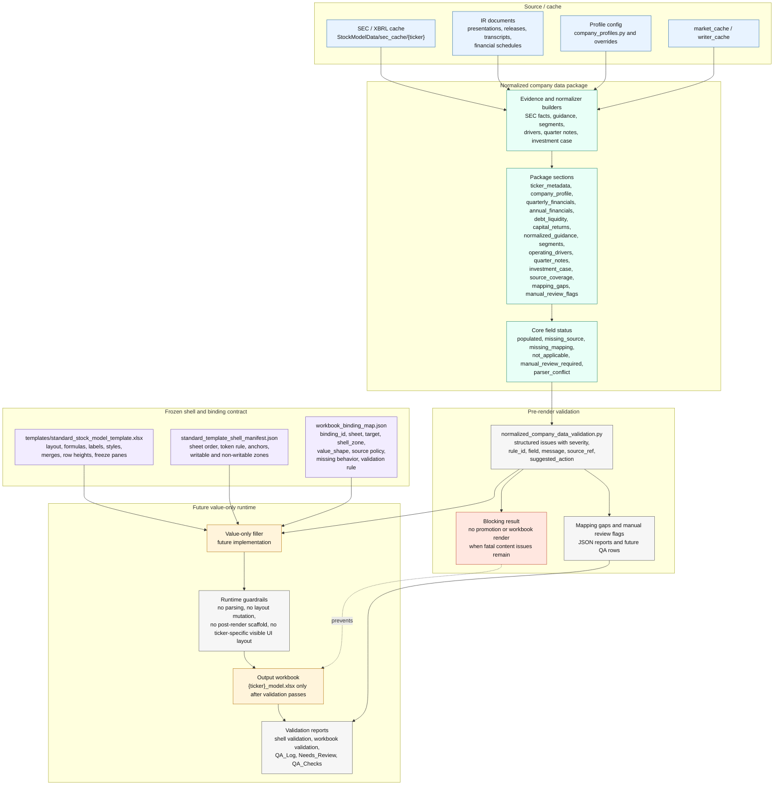
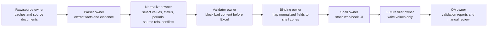

> Historical migration/target-state artifact; not the current operator authority.

# New-Ticker Engine Flow

This document shows where the reusable new-ticker engine should fit after the architecture and frozen-shell passes. It is intentionally a target-state map, not a runtime implementation plan. The value-only filler is shown as a future component and is not implemented in this pass.

Primary source documents:

- `docs/normalized_company_data_contract.md`
- `docs/normalized_company_data.schema.json`
- `docs/workbook_binding_map.json`
- `docs/standard_template_shell_manifest.json`
- `docs/workbook_template_shell_strategy.md`
- `docs/sheet_data_flow_map.json`

Renderable Mermaid source: `docs/new_ticker_engine_flow.mmd`.

## Target Architecture

## Data Ownership Boundaries

The contract is deliberately narrow:

- The normalized package owns values, statuses, source refs, mapping gaps, and manual review flags.
- The validator owns pre-render content quality and promotion blocking.
- The frozen shell owns layout, visible UI structure, formulas, static labels, merges, styles, dimensions, and anchors.
- The binding map owns the relationship between normalized fields and writable workbook zones.
- The future filler may only combine those three inputs: package, shell, binding map.

## Sheet Binding Flow

```mermaid
flowchart TB
  classDef sheet fill:#f2ecff,stroke:#7655b5,color:#111111
  classDef section fill:#e8fff7,stroke:#27876a,color:#111111
  classDef qa fill:#f6f6f6,stroke:#626262,color:#111111

  CompanyProfile["company_profile"]:::section --> SUMMARY["SUMMARY"]:::sheet
  Quarterly["quarterly_financials"]:::section --> SUMMARY
  Debt["debt_liquidity"]:::section --> SUMMARY

  Quarterly --> Valuation["Valuation"]:::sheet
  Annual["annual_financials"]:::section --> Valuation
  Debt --> Valuation
  Capital["capital_returns"]:::section --> Valuation
  Guidance["normalized_guidance"]:::section --> Valuation

  Segments["segments"]:::section --> BSSegments["BS_Segments"]:::sheet
  Debt --> BSSegments
  Quarterly --> BSSegments
  Annual --> BSSegments

  Drivers["operating_drivers"]:::section --> OperatingDrivers["Operating_Drivers"]:::sheet
  Guidance --> OperatingDrivers
  Quarterly --> OperatingDrivers

  InvestmentCaseData["investment_case"]:::section --> InvestmentCase["{ticker}_Investment_Case"]:::sheet
  Guidance --> InvestmentCase
  Segments --> InvestmentCase
  Drivers --> InvestmentCase
  QuarterNotesData["quarter_notes"]:::section --> InvestmentCase

  QuarterNotesData --> QuarterNotes["Quarter_Notes_UI"]:::sheet
  Quarterly --> QuarterNotes
  Guidance --> QuarterNotes

  Guidance --> PromiseProgress["Promise_Progress_UI"]:::sheet
  SourceCoverage["source_coverage"]:::section --> PromiseProgress
  QuarterNotesData --> PromiseProgress

  SourceCoverage --> QALog["QA_Log"]:::qa
  ManualFlags["manual_review_flags"]:::section --> NeedsReview["Needs_Review"]:::qa
  MappingGaps["mapping_gaps"]:::section --> QAChecks["QA_Checks"]:::qa
  ValidationIssues["validation issues"]:::qa --> QALog
  ValidationIssues --> NeedsReview
  ValidationIssues --> QAChecks
```

## Runtime Must Not Do These Things

```mermaid
flowchart TB
  Runtime["Future value-only filler"]:::runtime
  Parse["Parse source files"]:::bad
  Mutate["Mutate layout, styles, merges,<br/>row/column sizes, formulas"]:::bad
  Scaffold["Create post-render scaffold<br/>or repair missing visible sections"]:::bad
  TickerUI["Use ticker-specific visible UI layout code"]:::bad
  HideBlanks["Leave missing core values blank<br/>without mapping gap or review reason"]:::bad

  Package["Use validated normalized package"]:::good
  Binding["Use workbook_binding_map.json"]:::good
  Shell["Use frozen template shell"]:::good
  Reports["Emit validation / review reports"]:::good

  Runtime -. must not .-> Parse
  Runtime -. must not .-> Mutate
  Runtime -. must not .-> Scaffold
  Runtime -. must not .-> TickerUI
  Runtime -. must not .-> HideBlanks
  Runtime --> Package
  Runtime --> Binding
  Runtime --> Shell
  Runtime --> Reports

  classDef runtime fill:#fff4db,stroke:#b57915,color:#111111
  classDef bad fill:#ffe7e0,stroke:#c04f35,color:#111111
  classDef good fill:#e8fff7,stroke:#27876a,color:#111111
```

## Remaining Runtime Questions

- Whether the normalized package builder should be one orchestrator module with section builders or separate commands per source class is still undecided.
- The support-sheet boundary needs one final runtime decision: support sheets should remain audit/reporting output, but they should not be source-of-truth inputs for visible UI binding.
- The exact output report format for workbook validation, mapping gaps, and manual review rows should be aligned before the filler writes the first workbook.
- Investment-case generation needs a generic evidence-backed section builder so ticker-specific visible UI branches are not copied into the future engine.
- Guidance classification needs a single normalizer before render; visible sheets should not infer whether a guidance row is revenue, EBITDA, capex, EPS, volume, or margin.
